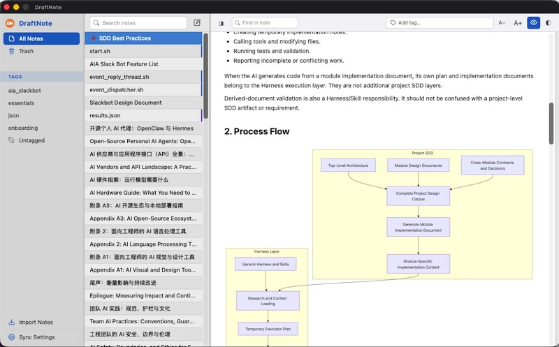
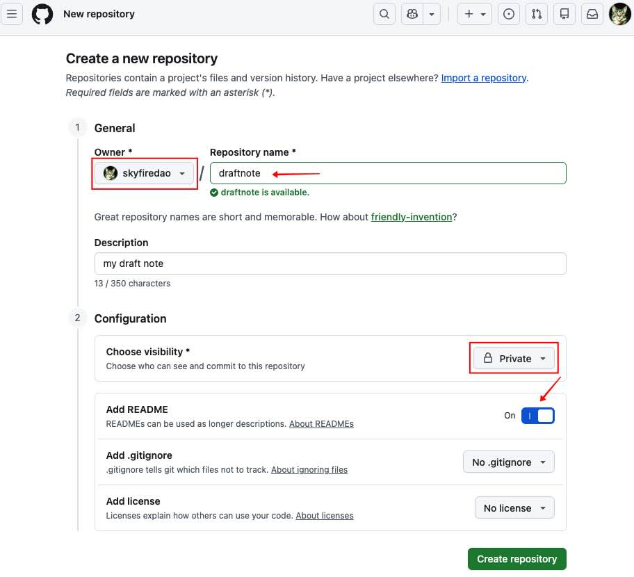

# draftnote

**English** | [中文](README_zh.md)

A cross-platform Markdown writing client for a single user. Notes are stored flat, classified by tags, and synced across devices, in the shape of Simplenote and Joplin. It runs on macOS, Windows, and iOS.



## Desktop features

Writing:

- Write in Markdown; switch a note to Shell or JSON when it holds code, with matching syntax highlighting
- Live preview with rendered Markdown and Mermaid diagrams
- Find within a note and jump between matches
- Adjustable font size and light/dark themes, both remembered

Organizing:

- All notes in one flat list, filtered by tag or by searching their text
- Pin notes to the top, duplicate them, or move them to trash; select several at once for batch actions
- Trash keeps notes for 90 days, then clears them automatically
- Add tags as chips above the editor
- Import individual files or a whole folder; export any view as Markdown or plain text

History:

- Every save keeps a version; open a note's history to see what changed and when
- Restore an earlier version at any time without losing the newer ones

Sync:

- Notes stay in sync across your devices through your own GitHub repository or a self-hosted server
- Edits are saved instantly and sent to the server moments later; your other devices pick them up on their own
- When the same note is changed in two places, both versions are kept together so you can merge them by hand

## Mobile (iOS)

Interface differences from the desktop:

- Three full-screen views (tags and folders, the note list, and the editor) shown one at a time, each with a back button at the top-left
- The editor keeps the back button in view and collapses the tag editor, font size, preview, and theme controls behind a single menu
- Pinch to zoom while previewing
- Import and export are desktop-only

## Usage

1. Launch the app. The last note you opened is opened automatically and the editor is focused.
2. **New note**: click the pencil icon at the top of the list column. The first non-empty line of the body becomes the title (Shell and JSON notes use the file name they were imported with).
3. **Change type**: right-click a note to switch it between Markdown, Shell, and JSON. The editor language and preview highlighter change to match, and exports pick the matching extension.
4. **Tag a note**: type in the tag input above the editor and press Enter (or click an existing pill to remove it). Tags appear as sections in the left column.
5. **Find in note**: click the magnifier icon in the editor toolbar, or press `Ctrl/Cmd+F`. Matches are highlighted; the scrollbar on the right shows a tick per match, click a tick to jump.
6. **Preview**: click the eye icon to toggle the preview pane. Markdown renders live with Mermaid; Shell and JSON render as syntax-highlighted code blocks.
7. **Pin / Duplicate / History / Trash**: right-click a note in the list. History opens the version panel; Delete Permanently appears only in the trash view. Multi-select with Ctrl/Cmd+click or Shift+click for batch trash / restore / delete.
8. **Import / Export**: the nav footer has an Import Notes button (from a directory or from individual files). `.md`, `.txt`, `.sh`, and `.json` are picked up; `.sh` / `.json` files keep their type and export back to the same extension. Right-click a nav entry (All Notes, Trash, Untagged, or any tag) to export that view as Markdown or plain text.
9. **Create a private GitHub repo** (skip if using a self-hosted backend or an existing repo): avatar menu → Repositories (below Profile) → New. Owner: your own account. Choose visibility: Private (the only option under your personal account). Check Add a README. Leave everything else at its default.

   
10. **Sync**: click the gear icon to open Sync Settings.

    Fill in:

    - **Repo URL** — the browser URL of the repo (`https://github.com/user/repo`, or your self-hosted equivalent). Base URL, owner, and repo are derived from it.
    - **Username** and **Token** — your credentials.
    - **Server URL** *(optional)* — overrides the base URL derived from Repo URL. Use it when the backend lives at a different host or port than the repo (e.g. `http://10.0.1.244:8015`).
    - **API mode** — on: GitHub's REST API with token auth (`github.com` is rewritten to `api.github.com`; a self-hosted URL keeps its own host). off: a self-hosted server that speaks the same API, authenticated with Basic username:token.

    **Validate & Save**: when a token is set, Save stays disabled until **Validate** passes; Validate runs a full sync.

    **In use**: edits save locally right away and push to the remote a few seconds after you stop typing; other devices on the same repo pull on their own schedule.

    **Storage**: config in `~/.draftnote/config.json` (token encrypted, not plaintext); notes under `~/.draftnote/notes/`.

## Self-hosted backend

The `backend/` directory ships a small Go service that answers the same Contents API subset the client speaks, backed by a plain git repo on disk. Point the client at it and set API mode off in Settings; the client will authenticate with Basic username:token.

Environment variables (all optional; the server runs with sensible defaults if none are set):

- `DRAFTNOTE_DATA` *(optional, default `/data`)* — working directory that holds the clone; the repo lives at `<data>/draftnote`
- `DRAFTNOTE_REMOTE_URL` *(optional)* — remote git URL to clone into `<data>/draftnote` when it does not exist; if the directory already contains a repo it is reused as-is
- `DRAFTNOTE_ADDR` *(optional, default `:8080`)* — listen address like `:8080` or `0.0.0.0:9000`
- `DRAFTNOTE_PORT` *(optional)* — listen port like `8015`; ignored when `DRAFTNOTE_ADDR` is set
- `DRAFTNOTE_USERNAME` *(optional)* — username the server will accept on incoming requests; the client must be configured with the same value in Sync Settings so its Basic-auth header matches
- `DRAFTNOTE_TOKEN` *(optional)* — token paired with the username above; also accepted alone as `Authorization: token <token>` for API-mode clients pointed at this URL. If empty, the server skips auth entirely and accepts any request (fine for a private LAN; do not expose to the public internet in this mode)

Mounted directory layout:

```
<data>/                     mount point (DRAFTNOTE_DATA, default /data)
└── draftnote/              the git repo the server operates on
    ├── .git/               full git history (revisions live here)
    └── notes/
        ├── <id>.json       one file per note
        └── …
```

`<data>/draftnote` is a real git checkout whose HEAD is kept on the `draftnote` branch; every PUT/DELETE is one commit on that branch. If you pre-place your own checkout at `<data>/draftnote` instead of using `DRAFTNOTE_REMOTE_URL`, it must be a normal git repo containing `notes/`.

Build and run locally:

```
cd draftnote/backend
go build -o draftnote-backend .
DRAFTNOTE_DATA=/tmp/dn-data \
DRAFTNOTE_USERNAME=alice \
DRAFTNOTE_TOKEN=s3cret \
./draftnote-backend
```

`-addr` sets the listen address, `-port` sets the listen port; default `:8080`. `DRAFTNOTE_ADDR` and `DRAFTNOTE_PORT` env vars work too.

Binary + Docker image in one shot (produces `draftnote-backend` and the local image `draftnote-backend:latest`):

```
cd draftnote/backend
bash build.sh
docker run --rm -p 8080:8080 \
  -v $PWD/data:/data \
  -e DRAFTNOTE_USERNAME=alice \
  -e DRAFTNOTE_TOKEN=s3cret \
  -e DRAFTNOTE_REMOTE_URL=https://github.com/user/repo.git \
  draftnote-backend:latest
```

`$PWD/data` is the mounted working directory. On first start the server clones `DRAFTNOTE_REMOTE_URL` into `$PWD/data/draftnote`. On restart it reuses the existing clone; there is no re-download. Skip `DRAFTNOTE_REMOTE_URL` if you have already placed a git checkout at `$PWD/data/draftnote` yourself.

If the client's Repo URL points at a different remote than the server's clone, the Sync Settings Validate button flags the mismatch and offers "Keep server" (recorded so the same mismatch is not flagged again) or "Reclone from Repo URL" (destructive: wipes the local clone and re-clones from the client's Repo URL).

The server also accepts `Authorization: token <token>` for clients that were configured with API mode on but point at the self-hosted URL; in that mode the username is not checked.

## Building

Toolchain:

- Rust (stable)
- Node 20+
- Tauri CLI: `cargo install tauri-cli --version '^2'`

Install frontend dependencies:

```
cd draftnote/rust-tauri/frontend
npm install
```

Desktop dev:

```
cd draftnote/rust-tauri
cargo tauri dev --features desktop
```

Desktop build:

```
cd draftnote/rust-tauri
cargo tauri build --features desktop
```

iOS:

```
cd draftnote/rust-tauri
cargo tauri ios init
cargo tauri ios build
```

Tests (client core and backend):

```
cd draftnote/rust-tauri/src-tauri && cargo test
cd draftnote/backend && go test ./...
```

CI configuration: [.github/workflows/draftnote_build.yml](../.github/workflows/draftnote_build.yml).

## License

GNU General Public License v3.0 or later. See [LICENSE](LICENSE).
